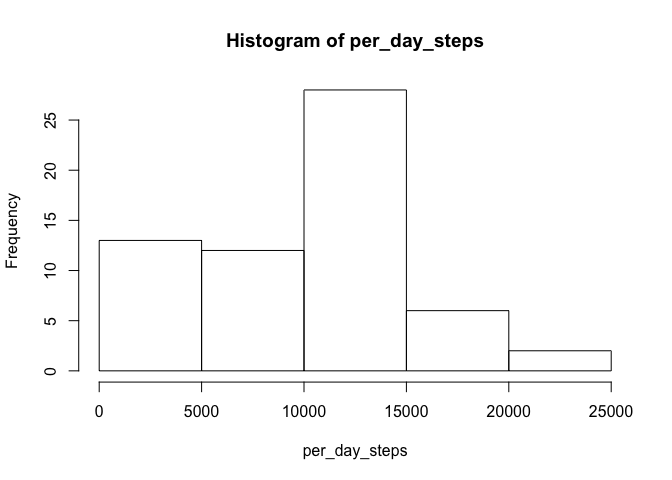
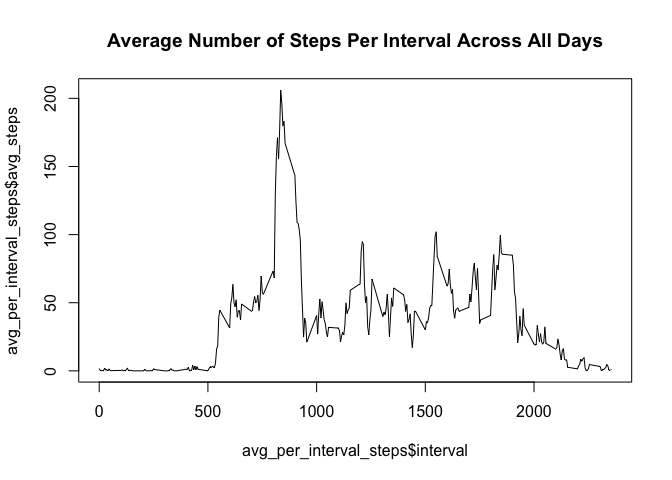
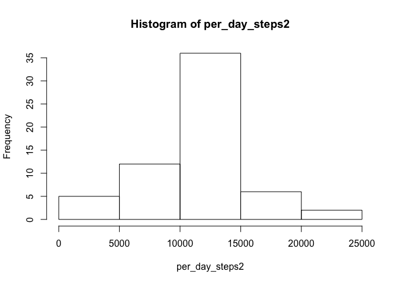
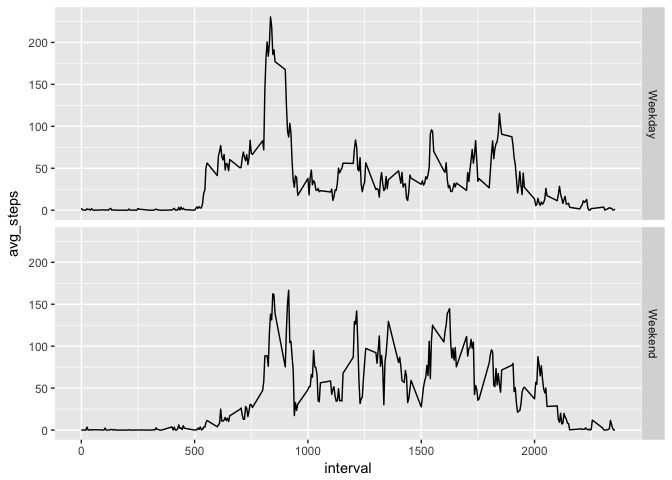

# Reproducible Research: Peer Assessment 1
## Loading and preprocessing the data

```r
unzip("~/RepData_PeerAssessment1/activity.zip") 
activity_data<-read.csv("~/RepData_PeerAssessment1/activity.csv")
```


## What is mean total number of steps taken per day?
1.Calculate the total number of steps taken per day

```r
per_day_steps<-tapply(activity_data$steps,activity_data$date,sum,na.rm=T)
per_day_steps
```

```
## 2012-10-01 2012-10-02 2012-10-03 2012-10-04 2012-10-05 2012-10-06 
##          0        126      11352      12116      13294      15420 
## 2012-10-07 2012-10-08 2012-10-09 2012-10-10 2012-10-11 2012-10-12 
##      11015          0      12811       9900      10304      17382 
## 2012-10-13 2012-10-14 2012-10-15 2012-10-16 2012-10-17 2012-10-18 
##      12426      15098      10139      15084      13452      10056 
## 2012-10-19 2012-10-20 2012-10-21 2012-10-22 2012-10-23 2012-10-24 
##      11829      10395       8821      13460       8918       8355 
## 2012-10-25 2012-10-26 2012-10-27 2012-10-28 2012-10-29 2012-10-30 
##       2492       6778      10119      11458       5018       9819 
## 2012-10-31 2012-11-01 2012-11-02 2012-11-03 2012-11-04 2012-11-05 
##      15414          0      10600      10571          0      10439 
## 2012-11-06 2012-11-07 2012-11-08 2012-11-09 2012-11-10 2012-11-11 
##       8334      12883       3219          0          0      12608 
## 2012-11-12 2012-11-13 2012-11-14 2012-11-15 2012-11-16 2012-11-17 
##      10765       7336          0         41       5441      14339 
## 2012-11-18 2012-11-19 2012-11-20 2012-11-21 2012-11-22 2012-11-23 
##      15110       8841       4472      12787      20427      21194 
## 2012-11-24 2012-11-25 2012-11-26 2012-11-27 2012-11-28 2012-11-29 
##      14478      11834      11162      13646      10183       7047 
## 2012-11-30 
##          0
```
2.Make a histogram of the total number of steps taken each day

```r
hist(per_day_steps)
```

<!-- -->

3.Calculate and report the mean and median of the total number of steps taken per day

```r
mean_per_day_steps<-mean(per_day_steps)
median_per_day_steps<-median(per_day_steps)
mean_per_day_steps
```

```
## [1] 9354.23
```

```r
median_per_day_steps
```

```
## [1] 10395
```


## What is the average daily activity pattern?
1.Make a time series plot of the 5-minute interval (x-axis) and the average number of steps taken, averaged across all days (y-axis)

```r
avg_per_interval_steps<-aggregate(activity_data$steps,list(activity_data$interval),mean,na.rm=T)
names(avg_per_interval_steps)<-c("interval","avg_steps")
plot(avg_per_interval_steps$interval,avg_per_interval_steps$avg_steps,type="l",main="Average Number of Steps Per Interval Across All Days")
```

<!-- -->

2.Report the 5-minute interval, on average across all the days in the dataset, that contains the maximum number of steps.

```r
interval_of_max_steps<-avg_per_interval_steps[which(avg_per_interval_steps$avg_steps==max(avg_per_interval_steps$avg_steps)),]$interval
interval_of_max_steps
```

```
## [1] 835
```


## Imputing missing values
1.Calculate and report the total number of missing values in the dataset 

```r
is_NA_activity<-activity_data[is.na(activity_data),]
nrow(is_NA_activity)
```

```
## [1] 2304
```
2.Devise a strategy for filling in all of the missing values in the dataset using the mean for the 5-minute interval.

```r
library(dplyr)
```

```
## 
## Attaching package: 'dplyr'
```

```
## The following objects are masked from 'package:stats':
## 
##     filter, lag
```

```
## The following objects are masked from 'package:base':
## 
##     intersect, setdiff, setequal, union
```

```r
temp<-left_join(is_NA_activity,avg_per_interval_steps,by="interval")
```
3.Create a new dataset that is equal to the original dataset but with the missing data filled in.

```r
activity_data2<-activity_data
activity_data2[is.na(activity_data2),]$steps<-temp$avg_steps
```
4.Make a histogram of the total number of steps taken each day. Calculate and report the mean and median total number of steps taken per day. 

```r
per_day_steps2<-tapply(activity_data2$steps,activity_data2$date,sum,na.rm=T)
hist(per_day_steps2)
```

<!-- -->

```r
mean_per_day_steps2<-mean(per_day_steps2)
median_per_day_steps2<-median(per_day_steps2)
mean_per_day_steps2
```

```
## [1] 10766.19
```

```r
median_per_day_steps2
```

```
## [1] 10766.19
```
From the calculation above, we see that both the mean and median total number of steps taken per day have increased to 10766.19.


## Are there differences in activity patterns between weekdays and weekends?
1.Create a new factor variable in the dataset with two levels – “weekday” and “weekend” indicating whether a given date is a weekday or weekend day.

```r
activity_data2$date<-as.Date(activity_data2$date)
activity_data2$weekday<-as.factor(weekdays(activity_data2$date))
levels(activity_data2$weekday)<-c("Weekday","Weekday","Weekend","Weekend","Weekday","Weekday","Weekday")
```
2.Make a panel plot containing a time series plot of the 5-minute interval (x-axis) and the average number of steps taken, averaged across all weekday days or weekend days (y-axis). 

```r
avg_per_interval_steps2<-aggregate(activity_data2$steps,list(activity_data2$interval,activity_data2$weekday),mean,na.rm=T)
names(avg_per_interval_steps2)<-c("interval","weekday","avg_steps")
library(ggplot2)
ggplot(avg_per_interval_steps2,aes(x=interval,y=avg_steps))+facet_grid(weekday~.)+geom_line()
```

<!-- -->

From the plot above we can see that the activity pattern in weekdays are different from the pattern in weekends. The former has only one peak and higher average number of steps per interval while the latter has multiple peaks and 
